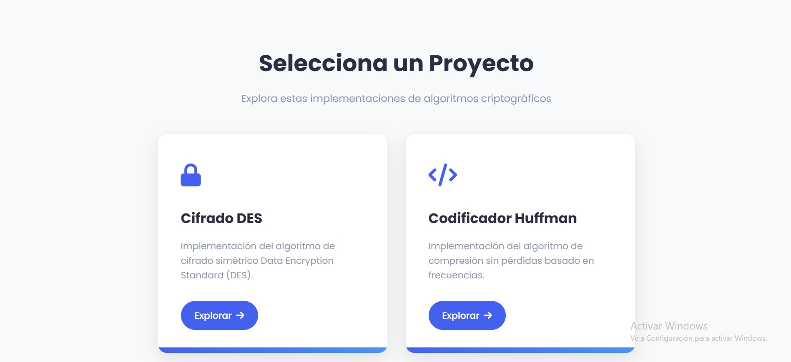
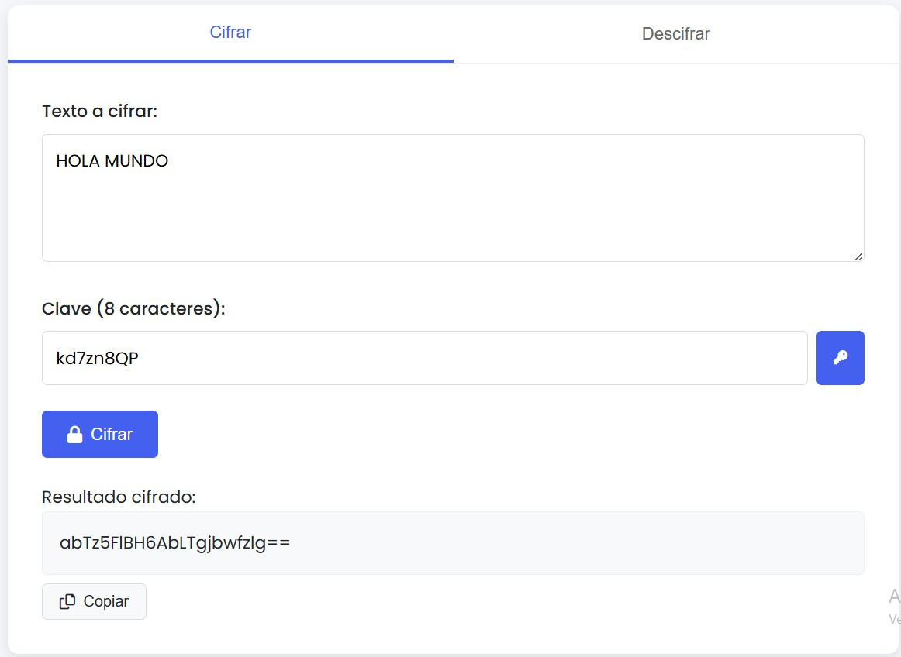
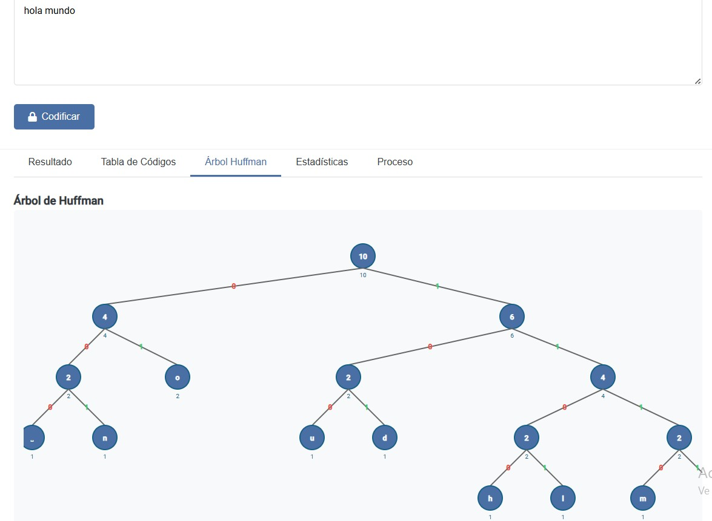

# Proyecto de Criptografía y Compresión: DES + Huffman  


Herramienta web que integra **cifrado DES** (seguridad) y **codificación Huffman** (compresión), desarrollada con Python y Flask.

## 🔍 Vista Previa  
**Interfaz principal**:  
  

**Cifrado DES**:  
  

**Compresión Huffman**:  
  

---

## 🎯 Objetivo  
Este proyecto busca implementar dos algoritmos fundamentales en el procesamiento de datos:  
- **DES (Data Encryption Standard)**: Para garantizar confidencialidad en la transmisión de información.  
- **Codificación Huffman**: Para compresión eficiente de datos sin pérdida.  

Ambos integrados en una interfaz web accesible y fácil de usar.

---

## 🛠️ Tecnologías y Herramientas  
### Backend  
- **Python 3.13+**: Lenguaje principal para la lógica de los algoritmos.  
- **Flask 2.0+**: Framework para crear la aplicación web y manejar rutas.  
- **Bibliotecas clave**:  
  - `pycryptodome` (opcional, para funciones criptográficas auxiliares en DES)  

### Frontend  
- **HTML5/CSS3**: Estructura y diseño de las interfaces.  
- **JavaScript**: Interactividad en los formularios y visualizaciones.  

### Desarrollo  
- **Git**: Control de versiones.  
- **Visual Studio Code**: Editor principal.  

---

## 📂 Estructura del Proyecto  
```plaintext
.
├── CRIPTOGRAFIA/
│   ├── cifrado_des/          # Módulo DES
│   │   ├── DES.py            # Lógica del cifrado (permutaciones, subclaves, etc.)
│   │   └── templates/        # HTML específico para DES
│   │
│   └── codificador_huffman/  # Módulo Huffman
│       ├── huffman.py        # Construcción de árbol y codificación/decodificación
│       └── templates/        # HTML para Huffman
│
├── static/                   # Assets
│   ├── css/                  # Estilos generales y específicos
│   ├── js/                   # Scripts para interacción
│   └── images/               # Capturas de pantalla/iconos
│
├── templates/                # Plantillas base
│   └── index.html            # Página de inicio con navegación
│
└── app.py                    # Punto de entrada de la aplicación Flask